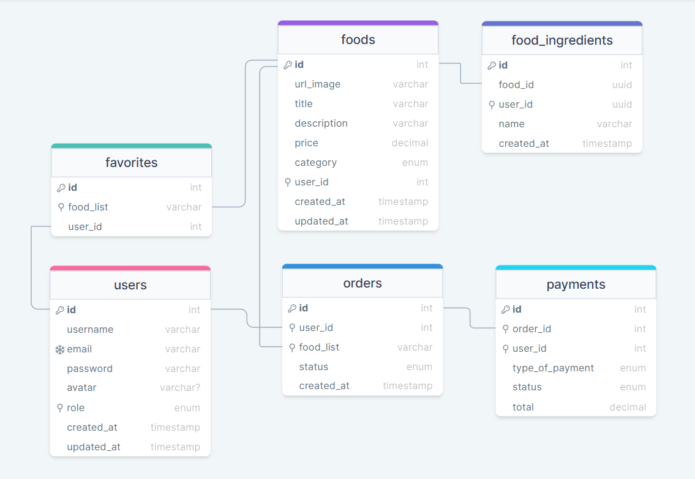

# Rocketseat - Projeto Final do Curso

Bem-vindo ao projeto [Food Explorer]! Este é um sistema FullStack de um restaurante construído com [React/ViteJs] no frontend e [Node/Express] no backend.

## Screenshots


Abaixo, você encontrará instruções sobre como configurar e executar o projeto em sua máquina local.

Link do repositório da API da aplicação:
[Acessar API](https://github.com/tonelopes-dev/explorerfood-projeto-final-api?tab=readme-ov-file)

Ou se preferir acessar o projeto com a conta do Cliente ou do Administrador:

Admin:

```bash
login: admin@rocketseat.com
senha: 123456
```

Cliente:

```bash
login: cliente@rocketseat.com
senha: 123456
```

## Pré-requisitos

### Antes de começar, certifique-se de ter instalado em sua máquina:

- [Node.js](https://nodejs.org/) - A versão recomendada é [inserir versão aqui].
- [npm](https://www.npmjs.com/) (gerenciador de pacotes Node.js) - Geralmente, é instalado automaticamente com o Node.js.

### Configuração

1. Clone este repositório ou faça o Download do projeto em sua máquina:

```bash
 git clone https://github.com/seu-usuario/seu-projeto.git
```

2. Entre no diretório do projeto

```bash
  cd explorer-desafio-final
```

3. Instale as node_modules da API executando o comando abaixo:

```bash
  cd api
```

4. Instale as dependências

```bash
  npm install
```

5. Inicie o servidor

```bash
  npm run dev
```

🥳 Parabéns servidor Online! 🎉

1. Agora em **Outro Terminal** você precisa Instalar as dependências e rodar Frontend em sua máquina.
   Entre no diretório do projeto

```bash
  cd explorer-desafio-final
```

2. Instale as node_modules da API executando o comando abaixo:

```bash
  cd web
```

3. Instale as dependências

```bash
  npm install
```

4. Inicie o Cliente Web

```bash
  npm run dev
```

5. Agora é só acessar o link em seu navegador:

```bash
  ➜  http://localhost:5173/
```

🥳 Parabéns Cliente Web Online! 🎉

## Documentação da API

### Rotas do usuário

#### Criação do usuário

```http
  POST /users
```

| Parâmetro  | Tipo     | Descrição                              |
| :--------- | :------- | :------------------------------------- |
| `name`     | `string` | **Obrigatório**. Seu nome              |
| `email`    | `string` | **Obrigatório**. Email único           |
| `password` | `string` | **Obrigatório**. Criação de uma senha. |
| `avatar`   | `string` | Enviar um foto.                        |

#### Atualização do usuário - (API pronta - Página web em Desenvolvimento)

```http
  PUT /users
```

| Parâmetro  | Tipo     | Descrição                              |
| :--------- | :------- | :------------------------------------- |
| `name`     | `string` | **Obrigatório**. Seu nome              |
| `email`    | `string` | **Obrigatório**. Email único           |
| `password` | `string` | **Obrigatório**. Criação de uma senha. |
| `avatar`   | `string` | Enviar um foto.                        |

#### Verificação de Token JWT - (API pronta - Página web em Desenvolvimento)

Essa busca o token no **Cookie** do navegador do usuário se o token ainda está validado para encaminha-lo para página Home, ou se o mesmo expirou encaminhando para a página de SignIn.

```http
  GET /users/validated
```

| Parâmetro         | Tipo     | Descrição = false       | Descrição = true         |
| :---------------- | :------- | :---------------------- | :----------------------- |
| `request.user.id` | `string` | **"Unauthorized"**, 401 | **response**.status(200) |

#### Login no sistema

```http
  POST /sessions
```

| Parâmetro  | Tipo     | Descrição        |
| :--------- | :------- | :--------------- |
| `email`    | `string` | email do usuário |
| `password` | `string` | senha de acesso  |

### Rotas do admin

#### Busca de items no banco de dados: refeições.

```http
  GET /foods/?categoryFood=meal
```

Retorna todos os items da categoria "meal"

```http
 [
  {
		"id": 1,
		"title": "Camarão",
		"category": "meal",
		"url_image": "7c7e5a42dfaa36bacd7c-Mask-group-2.png",
		"price": 10000,
		"description": "Um exemplo de descrição de uma Prato de camarão.",
		"created_at": "2024-01-18 13:52:47",
		"updated_at": "2024-02-14 15:24:25",
		"ingredients": [
			"arroz",
			"camarão",
			"molho branco"
		]
	},
	{
		"id": 15,
		"title": "Forafa",
		"category": "meal",
		"url_image": "c443ba83806eca09a122-Mask-group-2.png",
		"price": 450000,
		"description": "Farofa deliciosa com Alho",
		"created_at": "2024-01-31 11:20:48",
		"updated_at": "2024-02-05 19:26:29",
		"ingredients": [
			"farinha",
			"Alho"
		]
	}
]
```

#### Outras routas de busca de dados:

Sobremesas

```http
  GET /foods/?categoryFood=dessert
```

Bebidas

```http
  GET /foods/?categoryFood=drink
```

#### Criação de um item: sobremesa/refeições/bebidas

```http
  POST /foods
```

| Parâmetro     | Tipo      | Descrição                                  |
| :------------ | :-------- | :----------------------------------------- |
| `title`       | `string`  | \* Nome do prato.                          |
| `category`    | `string`  | \* Categoria do prato.                     |
| `ingredients` | `Array`   | \* Informar todos os ingredientes.         |
| `price`       | `Integer` | \* Informar o preço                        |
| `description` | `String`  | \* Sua Nota para o filme de 0 a 5.         |
| `url_image`   | `String`  | Envio da foto do prato: upload do arquivo. |

- _Campos obrigatórios_ \*

#### Criação de um item: sobremesa/refeições/bebidas

```http
  GET /foods/:id
```

Buscar o item pelo **id**

```
exemplo: http://localhost:5173/foods/15

 [ {
		"id": 15,
		"title": "Forafa",
		"category": "meal",
		"url_image": "c443ba83806eca09a122-Mask-group-2.png",
		"price": 450000,
		"description": "Farofa deliciosa com Alho",
		"created_at": "2024-01-31 11:20:48",
		"updated_at": "2024-02-05 19:26:29",
		"ingredients": [
			"farinha",
			"Alho"
		]
	}
]
```

## Funcionalidades

### Usuário

- Logout no sistema ✅
- Criação de Usuários ✅
- Login no sistema por autenticação ✅
- Remover pratos dos favoritos ( 🧑‍💻`Em desenvolvimento`)
- Atualizar Cadastro do Usuário ( 🧑‍💻`Em desenvolvimento`)
- Adicionar pratos aos favoritos ( 🧑‍💻`Em desenvolvimento`)

### Admin

- Criar prato ✅
- Editar prato ✅
- Deletar prato ✅
- Deletar Usuário ( 🧑‍💻`Em desenvolvimento`)
- Atualizar Perfil ( 🧑‍💻`Em desenvolvimento`)
- Mudar status dos pedidos. ( 🧑‍💻`Em desenvolvimento`)
- Mudar status do pagamento. ( 🧑‍💻`Em desenvolvimento`)
- Notificar o cliente por whatsapp/Email ( 🧑‍💻`Em desenvolvimento`)

### Rotas / Páginas

- Home ✅
- SignIn ✅
- SignUp ✅
- Novo Prato ✅
- Menu Mobile ✅
- Editar pratos ✅
- Detalhes do prato ✅
- Pedidos ( 🧑‍💻`Em desenvolvimento`)
- Favoritos ( 🧑‍💻`Em desenvolvimento`)
- Pagamentos ( 🧑‍💻`Em desenvolvimento`)
- Status dos pedidos ( 🧑‍💻`Em desenvolvimento`)
- Perfil Usuário/Admin ( 🧑‍💻`Em desenvolvimento`)

## Tabelas SQL



## Stack utilizada

**Front-end:** React + Vite, Styled components, Swiper, Axios.

**Back-end:** Node, Express, Knex, SQLite, JWT, Brcrypt, Cookie, Cors, Multer, Nodemoon.

## 🚀 Sobre mim

Eu sou uma pessoa desenvolvedora full-stack.. [Tone Lopes](https://portfolio-v2-tonelopes.vercel.app/)
